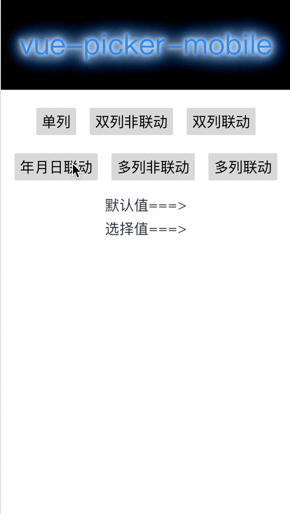

# vue-picker-mobile
一款操作简单的移动端列表选择器，支持单列、多列，联动、非联动，配有详细的Demo

## Demo
### 单列.gif


### 两列
#### 非联动&&&&联动


### 多列
#### 多列非联动&&&&联动&&时间列表
 

## Installation

#### NPM
Install the package

`npm install vue-picker-mobile --save`

```javascript
import VuePickerMobile from 'vue-picker-mobile'

export default {
  components: {
    VuePickerMobile,
  },
}
```
`<VuePickerMobile/>`


## Props/Options

### list

- Type: `Array`
- Default: `[]`

列表的数据源

### defaultValue

- Type: `Array` 
- Default: `[]`

列表的默认滚动位置

### isMulti

- Type: `Boolean` 
- Default: `false`

列表是单列还是多列

### isRelate

- Type: `Boolean` 
- Default: `false`

列表是否联动

### isShow

- Type: `Boolean` 
- Default: `false`

是否展示下拉列表


